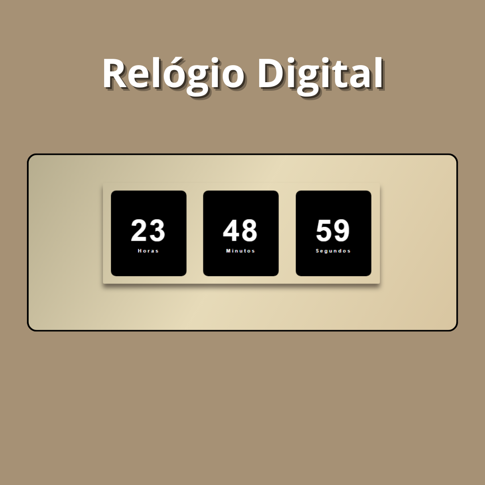

<h1 align="center">Projeto - Relógio Digital</h1>

Utilizei o projeto da Larissa Kich por meio do YouTube.
  https://ldcmartins.github.io/relogio/

  <a href="#-tecnologias">Tecnologias</a>&nbsp;&nbsp;&nbsp;|&nbsp;&nbsp;&nbsp;
  <a href="#-projeto">Projeto</a>&nbsp;&nbsp;&nbsp;|&nbsp;&nbsp;&nbsp;
  <a href="#-layout">Layout</a>&nbsp;&nbsp;&nbsp;|&nbsp;&nbsp;&nbsp;
  <a href="#memo-licença">Licença</a>

  

 

  

## 🚀 Tecnologias

Esse projeto foi desenvolvido com as seguintes tecnologias:

- HTML e CSS
- JavaScript
- Git e Github

## 💻 Projeto

Relógio Digital

## 🎓 Aprendizado

Um projeto simples, porém pude aprender um pouco mais de JavaScript.  
Está sendo muito bacana e desafiador poder aprender sobre a linguagem JS e sobre os if's e seus demais comandos.

## :memo: Licença

Esse projeto está sob a licença MIT.

